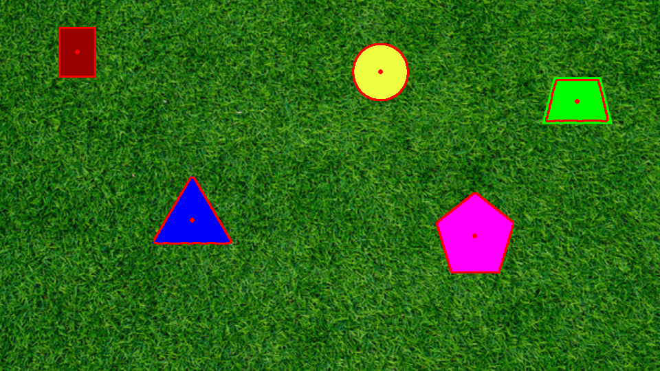
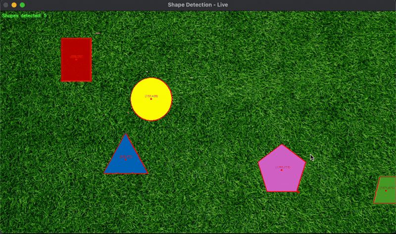

# PennAir-Software-Challenge

Develop an algorithm to detect solid shapes on a grassy background, trace their outlines, locate their centers.

## <u>Tasks Completed</u>

### Task 1: Shape Detection on Static Image ✅

- Approach was to use both a colored and texture approach to distinguish between the grass and the solid shapes.
  - The colored approach involved comparing all the shapes against green background and distinguishing shapes. However, this excluded the green colored solid shapes.
  - Thus, we added the texture approach to ensure we also include green colored solid shapes.
- Once we could distinguish between the grass and the shapes, we could draw the outline around the shapes and determine their centerpoints.

### Task 2: Shape Detection on Video ✅

- Approach is to apply the algorithm developed from Task 1 to each frame of the video, because each frame of the video is essentially a snapshot of an image.
- Compartmentalizing the code in Task 1 into a function and call it for every frame in the video by running it through an infinite loop that reads the video until it ends or until user breaks out of the loop.
- The algorithm somewhat works, with issues with maintaining the correct number of shapes counted and calculating the center of the shapes when the shapes overlap. I improved on the previous algorithm by adding a shape count and displaying the coordinates of the centerpoint of each shape.

## Dependencies

- Code was written in Python 3.13.5 with the libraries `numpy` and `cv2` installed. You can use the following to install these packages:
  - `pip3 install numpy`
  - `pip3 install opencv-python`
- To run code
  1. Clone the repository onto your local computer
  2. For Task 1, type `python3 shape_etection.py` in the terminal and hit enter. The file "Detected_Static_Shape.png" will contained the detected shapes.
  3. For Task 2, type 'python `video_detection.py` in the terminal and hit enter. The live feed of our algorithm will pop up in a window until the video ends or you force quit the window.
  - keyboard controls for the live window
    - Type `q` to quit the window
    - Type `p` to pause the video
    - Type `s` to save the frame
